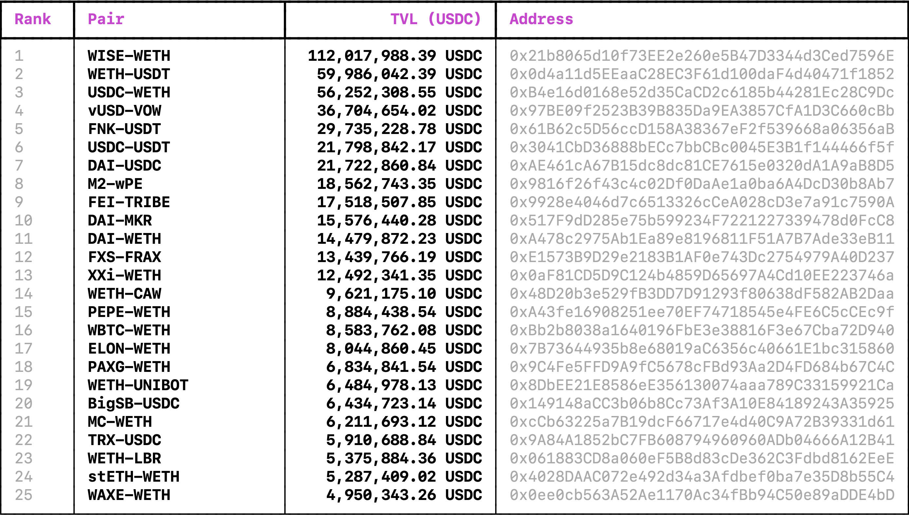

# Uniswap V2 Liquidity Analyzer

A command-line tool for analyzing liquidity in Uniswap V2 pairs on the Ethereum network. Fetch data on active pairs, token prices, and Total Value Locked (TVL) with enhanced visuals and efficiency.



## Table of Contents

- [Features](#features)
- [Installation](#installation)
- [Usage](#usage)

## Features

- Connects to the Ethereum blockchain using Web3.
- Fetches and filters active liquidity pairs on Uniswap V2.
- Calculates token prices based on liquidity paths.
- Computes Total Value Locked (TVL) for each active pair.
- Displays top `n` pairs based on TVL with a visually appealing table format.
- Enhanced command-line visuals using `rich`.

## Installation

1. Clone the repository:
   ```bash
   git clone https://github.com/mikle97pir/uniswap-v2-liquidity-analyzer.git
   cd uniswap-v2-liquidity-analyzer
   ```

2. Install the required packages:
   ```bash
   pip install -r requirements.txt
   ```

## Usage

To start the program with the default options:
```bash
python main.py
```

Additional command-line options:

- `--refresh-all` or `-R`: This will update all data, including the list of pairs and tokens considered active. However, using this option can be much longer as it downloads a significant amount of transaction receipts. This can be problematic without your own node due to the extensive number of requests.
  
- `--refresh-pairs-info` or `-r`: Updates the TVL and order of pairs in the output, but doesn't update the list of pairs and tokens considered active, which means some pairs might be missed. Faster than using `-R`.

- `--number-of-pairs` or `-n`: Set the number of top pairs to display based on TVL.

- `--rpc`: Specify your own RPC endpoint. The default one provided is free but might not handle a large volume of requests efficiently.

Example:
```bash
python main.py -r -n 25
```
This command will refresh the Total Value Locked and order of pairs but will use the previously fetched list of active pairs and tokens.

### Sample Output

```
┏━━━━━━━┳━━━━━━━━━━━━━━━━━━━━━━┳━━━━━━━━━━━━━━━━━━━━━━┳━━━━━━━━━━━━━━━━━━━━━━━━━━━━━━━━━━━━━━━━━━━━┓
┃ Rank  ┃ Pair                 ┃           TVL (USDC) ┃ Address                                    ┃
┡━━━━━━━╇━━━━━━━━━━━━━━━━━━━━━━╇━━━━━━━━━━━━━━━━━━━━━━╇━━━━━━━━━━━━━━━━━━━━━━━━━━━━━━━━━━━━━━━━━━━━┩
│ 1     │ WISE-WETH            │  116,670,022.88 USDC │ 0x21b8065d10f73EE2e260e5B47D3344d3Ced7596E │
│ ...   │ ...                  │  ...                 │ ...                                        │
│ 25    │ WAXE-WETH            │    5,110,986.61 USDC │ 0x0ee0cb563A52Ae1170Ac34fBb94C50e89aDDE4bD │
└───────┴──────────────────────┴──────────────────────┴────────────────────────────────────────────┘
```